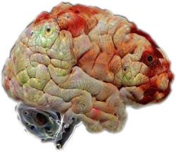

## Multi-Modality Visualization Tool

The visualization and exploration of neuroimaging data is
important for the analysis of anatomical and functional images and
statistical parametric maps. While two-dimensional orthogonal views of
neuroimaging data are used to display activity and statistical analysis,
real three-dimensional (3d) depictions are helpful for showing the spatial
distribution of a functional network, as well as its temporal evolution.
For our best knowledge, currently there is no neuroimaging 3d tool which
can visualize both MEG, fMRI and invasive electrodes (ECOG, depth
electrodes, DBS,  etc.). Here we present the multi-modality
visualization tool (MMVT). The tool was built for researchers who wish to
have a better understanding of their neuroimaging anatomical and functional
data. The true power of the tool is by visualizing and analyzing data from
multi-modalities. MMVT is built as two separated modules: The first is
implemented as an add-on in 'Blender”, an open-source 3d visualization
software. The add-on is an interactive graphic interface which enable to
visualize functional and statistical data (MEG and/or fMRI) on the cortex
and subcortical surfaces, invasive electrodes activity and so on. The tool
can also be used for a better 3d visualization of the anatomical data and
the invasive electrodes locations. The other module is a standalone
software, for importing and preprocessing. The users can select the data
they want to import to Blender and how they want to process it. The module
support many types of analyzed data, like FsFast (FreeSurfer Functional
Analysis Stream) and SPM (Statistical Parametric Mapping) for fMRI, MNE (a
software package for processing MEG and EEG) raw data for MEG and
FieldTrip (MATLAB software toolbox for neuroimaging analysis) data
structures for the invasive electrodes. The users can also reprocess raw
data using a wrappers for FaFast and mne-python (a python package for
sensor and source-space analysis of MEG and EEG data).

## Videos

## Installation

- [Linux installtion](https://docs.google.com/document/d/1a3fo0sGuff7CadYNbh06Xrx4whcebrPo7K2xxXGpqA4/edit?usp=sharing)
- [Windows installtion](https://docs.google.com/document/d/1uUCgElXcY884qb-vZ4EZGqLPbRWZH7ni6qVPQbkwXn8/edit?usp=sharing)

After the installation, you'll need a blend file of a template subject. For that, please contact me: npeled@mgh.harvard.edu

The tool itself, can run on windows, mac and linux. If you want to connect it to freeview, you'll need to run it only on freesurfer compatible os, meaning linux and mac.
Also in the preprocessing tool there are few call to freesurfer, so mainly to create the anatomy files you'll need a os with freesurfer.
Beside of that, you can use the tool also on windows.

## Contributors
- Ohad Felsenstein (ohadfel@gmail.com)
- Noam Peled (npeled@mgh.harvard.edu)

## Licensing

MMVT is **BSD-licenced** (3 clause):

    This software is OSI Certified Open Source Software.
    OSI Certified is a certification mark of the Open Source Initiative.

    Copyright (c) 2016, authors of MMVT
    All rights reserved.

    Redistribution and use in source and binary forms, with or without
    modification, are permitted provided that the following conditions are met:

    * Redistributions of source code must retain the above copyright notice,
      this list of conditions and the following disclaimer.

    * Redistributions in binary form must reproduce the above copyright notice,
      this list of conditions and the following disclaimer in the documentation
      and/or other materials provided with the distribution.

    * Neither the names of MMVT authors nor the names of any
      contributors may be used to endorse or promote products derived from
      this software without specific prior written permission.

    **This software is provided by the copyright holders and contributors
    "as is" and any express or implied warranties, including, but not
    limited to, the implied warranties of merchantability and fitness for
    a particular purpose are disclaimed. In no event shall the copyright
    owner or contributors be liable for any direct, indirect, incidental,
    special, exemplary, or consequential damages (including, but not
    limited to, procurement of substitute goods or services; loss of use,
    data, or profits; or business interruption) however caused and on any
    theory of liability, whether in contract, strict liability, or tort
    (including negligence or otherwise) arising in any way out of the use
    of this software, even if advised of the possibility of such
    damage.**
